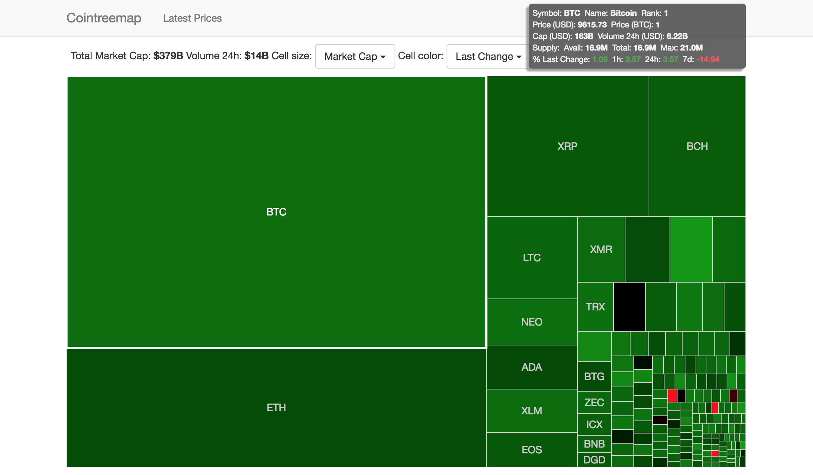

### Cointree
A cryptocurrency treemap visualization built with [Meteor](https://www.meteor.com/) using the [pup boilerplate](http://cleverbeagle.com/pup), [react](https://reactjs.org/), and [D3js](https://d3js.org/).

This application demonstrates several useful patterns in Meteor including:
* polling a 3rd party HTTP endpoint for data [coinmarketcap](https://coinmarketcap.com)
* doing bulk mongodb inserts to avoid excessive refreshes on the client as cryptocurrency data is updated one currency at a time
* using D3 in combination with react

This project was inspired by one of the early financial industry examples of the treemap, the [map of the market](http://www.bewitched.com/marketmap.html) from smartmoney.com which regrettably isn't live anymore.

Note that I haven't removed all the parts of the pup boilerplate that I didn't use. Notably pup includes authentication, social logins, and a *documents* collection, none of which are ued here.

This application polls every 3 minutes via a cron job defined in [imports/modules/server/cron-poll-coinmarketcap.js](imports/modules/server/cron-poll-coinmarketcap.js). The cron job does a bulk insert into the [Prices](imports/api/Prices/Prices.js) and [LatestPrices](imports/api/LatestPrices/LatestPrices.js) collections. The former tracks each price change in each cryptocurrency while the latter only maintains the most recent price change for faster publishing to the client. There's no point in polling any faster than 3 minutes as the API being called unfortunately doesn't update prices much faster than that. Also the current code limits the data being stored and displayed to those cryptocurrencies with a market *cap* over $50M USD.

The [percolate:synced-cron](https://github.com/percolatestudio/meteor-synced-cron) package is used to define cron jobs. If you're curious as to why there's no `import` for it - it's a Meteor classic style *Atmosphere* package that defines an object in the global scope.

The Treemap is defined as a page [here](imports/ui/pages/Treemap/Treemap.js). As you might know, react and D3 don't really get along very well as both want to control the DOM directly. My react D3 code came from the [rd3](https://github.com/yang-wei/rd3) project which unfortunately isn't maintained anymore. I had to make a number of corrections and adaptations to make it work for this use case, particularly to color code each currency based on price changes.

#### Run the app locally
1. Make sure Meteor and npm are installed
1. clone this repo
1. `npm install`
1. `npm start`
1. Open [localhost:3000](http://localhost:3000) in your browser

You may have to wait up to 3 minutes for the first data to be available.

#### Screenshot

#### License
MIT

Copyright (c) 2018 Michel Floyd
